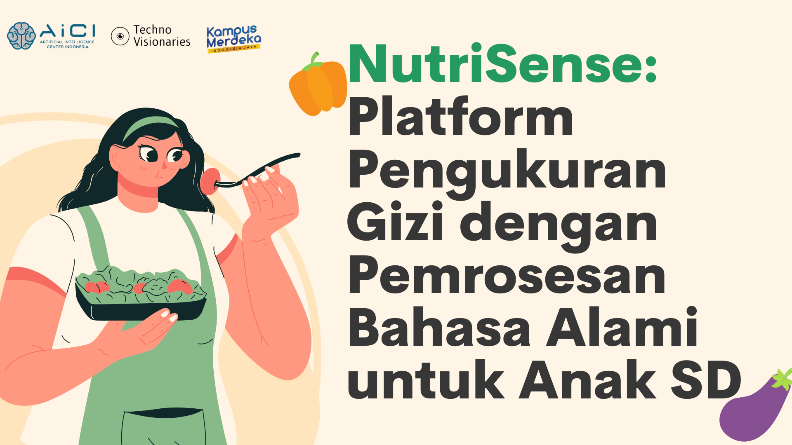

# Nutrisense - *Smart Nutrition Recommendation System*

  

  
Website rekomendasi menu masakan dengan nutrisi sesuai input gender dan umur pengguna, serta menyesuaikan makanan dengan kata kunci yang diberikan.</

## 🚀 Features
- **Personalized nutrition recommendations** based on user profile
- **Gender and age-based calculations** for accurate nutritional needs
- **Food search by keywords** to find specific dishes
- **Modern Vue.js frontend** with responsive design
- **Flask REST API backend** for robust data processing

---

  <table>
    <tr>
      <td width="50%">
        
      </td>
      <td width="50%" style="vertical-align: top; padding-left: 20px;">
        <h3>🥗 Nutrition Made Simple</h3>
        
<strong>Nutrisense</strong> adalah solusi cerdas untuk mendapatkan rekomendasi nutrisi yang tepat sesuai dengan profil Anda.

        <ul>
          <li>📊 <strong>Analisis Personal</strong> - Berdasarkan gender & umur</li>
          <li>🔍 <strong>Pencarian Makanan</strong> - Dengan kata kunci</li>
          <li>🎯 <strong>Rekomendasi Akurat</strong> - Nutrisi yang sesuai</li>
          <li>⚡ <strong>Interface Modern</strong> - User-friendly design</li>
        </ul>
        <b>Nutrisense</b>
        <a href="https://youtu.be/9HZvribDgIE?si=WblD8DHJ-DUuWiQb">Link Video Persentasi Project.</a>
      </td>
    </tr>
  </table>

 
<h2 align="center">Terima Kasih</h2>